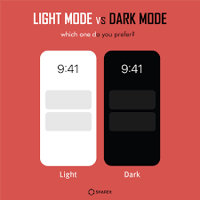

# Project 2 🎤🎶🎧

Welcome to CODEversity Project 2. This project will take about 2 weeks and it will be due Week 7!

### Recap of the project so far

[Project 0](https://replit.com/@adityavarshney1/CODEversity-Spotify-P0) started with a simple app built with Flask. When we ran our app, a page opened up containing a header with the text "Hello world". Our website was born.

[Project 1](https://replit.com/@adityavarshney1/CODEversity-Spotify-P1) created a webpage that showcased our favorite music. To do this, we built HTML files for each page, added images into our project, and updated styling rules in CSS.

## Goals for Project 2

For this section, we want to use flask to make live updates to our page. To do this, we'll use flask's **templating**.

### Templating using Jinja

Under the hood, we've already been using `render_template` to allow our server running python to show our HTML and CSS. However, our templates so far have just been references to the HTML file itself and do not include any information from the back-end.

The core issue is that the HTML is static and does not change. Think of it like the skeleton of our webpage - it is just the structure and cannot do anything without muscles and a brain to move it around.

To allow our HTML to switch between light mode and dark mode, we will need some way to update our HTML and CSS based on what time it is.

We will first need to identify the time in Python and then send this information (along with any other information) to our front-end.

### Using placeholders

To pass values into our webpage from the back-end, we use `render_template`. 

`render_template` takes in the reference to the HTML page ("playlists.html") as well as any placeholder variables to show on the page.

This section has a lot of new content, so please take a careful look at the examples to better understand how Jinja syntax, Python, and HTML/CSS work together!

Other resources in case anything below is confusing:
* [RealPython's Primer on Jinja Templating](https://realpython.com/primer-on-jinja-templating/#use-an-external-file-as-a-template)
* [Flask's docs on Templates](https://flask.palletsprojects.com/en/1.1.x/tutorial/templates/)

#### Placeholder Variables

Let's suppose that we add the following code to our HTML:

```html
<p> {{ template_artist_name }} </p>
<p> {{ template_number_of_albums }} </p>
<p> {{ template_favorite_song }} </p>
```

This creates Jinja placeholders.

These are passed in to our template from our python code as follows: 
```python
artist_name = "Miguel"
number_of_albums = 4
favorite_song = "Sky Walker"

render_template(
  "playlists.html", 
  template_artist_name = artist_name, 
  template_number_of_albums = number_of_albums, 
  template_favorite_song = favorite_song
)
```
In the code above, Python variables appear on the right side of each equal sign while the template name values appear on the left side. 

> ##### :brain: Advanced: How does `render_template` work? 
> The way we pass template variables and values to `render_template` is quite different from standard Python syntax.
> Normally, Python functions have a fixed number of arguments and variables.
> Take this example that prints out song name and metadata
> ```python
> def print_song(song_name: str) -> None:
>   print(f"Song name is {song_name}")
>
> # Call the function.
> print_song("Sky Walker")
> ```
>  
> `render_template`, however, supports *ANY* valid Jinja template and has no way of knowing
> the template variables and Python values it will receive in advance.
> Instead, it accepts arguments as keyword arguments, or `kwargs` for short, and handles them
> in a generic way to update the template no matter which variables are passed in.
>
> This is a common pattern for when function parameters and values are not known in advance.
> In the example below, we create a function called `print_song_name_and_other_metadata` that takes in a known argument as well as `kwargs` and prints out the different values.
> ```python
> def print_song_name_and_other_metadata(song_name: str, **kwargs) -> None:
>   print(f"Song name is {song_name}")
>   for metadata_key, metadata_value in kwargs.items():
>     print(f"Key: {metadata_key}")
>     print("____")
>     print(f"Value: {metadata_value}")
>
> # Call the function
> print_song_name_and_other_metadata(
>   "Sky walker", 
>    album = "War & Leisure", 
>    released = 2017,
>    artist = "Miguel",
>  )
> ```
> Notice how similar this function call is to our `render_template` call above:
> ```python
> render_template(
>   "playlists.html", 
>   template_artist_name = artist_name, 
>   template_number_of_albums = number_of_albums, 
>   template_favorite_song = favorite_song
> )
> ```
> This should give you an idea of how `render_template` works under the hood :stuck_out_tongue_winking_eye:

#### If statements

Similar to the previous example on [Placeholder Variables](#placeholder-variables), Jinja conditionals let us choose the HTML we use based on the template variables we pass in.

```html
<body>
  
  <h1 class="legendary-artist">Legendary Artist</h1>
  <!-- Custom HTML for legendary artists goes here -->
  <h1 class="experienced-artist">Experienced Artist</h1>
  <!-- Custom HTML for experienced artists goes here  -->
  
  <h1 class="rising-star">Rising Star</h1>
  <!-- Custom HTML for rising stars goes here -->
  
  <!-- Outside the if/elif/else. The code below is always shown. -->
  <p>{{ template_artist_name }} has put out {{ template_number_of_albums }} albums.</p>
</body>
```
In the code above, we use our pre-existing template variable `template_number_of_albums` to choose what HTML to show within our HTML document. At the end, we indicate how many albums the artist has produced.

#### For loops 

Lastly, Jinja for loops allow us to loop through **iterable** variables, such as lists or strings.

Take a look at the example below to see how this works:

```python
artist_name = "Slide (Remix)"
song_name = "H.E.R."
# List of featured artists.
features_list = ["Pop Smoke", "A Boogie Wit da Hoodie", "Chris Brown"]
# Call to render the page.
render_template(
  "playlists.html", 
  template_song_name = song_name, 
  template_artist_name = artist_name, 
  template_features_list = features_list
)
```
The code above passes variables in our Python code to the HTML template.
Note that the `features_list` is a Python list.

In `playlists.html`, we update the template to include the template variables. 
Using a for loop, we can access each of the featured artists on a given song: 

```html
<!-- playlists.html --> 
<div class="song-details">
  <h3>Favorite song: {{ template_song_name }}</h3>
  <div class="song-discography">
    <p class="song-creator-details"> {{ template_artist_name }} </p>
    <ul>
      
      <li> {{ featured_artist }} </li>
      
    </ul>
  </div>
</div>
```
This template sets up a div that contains the song name, song artist, and a bullet point for each of the featured artists on the song.

### Putting it together: a comprehensive example

Let's consider an example. Suppose we want to show the time that the user arrived on the page.

> Hint: You may want to use something similar to get the time when deciding the time of day for dark mode!

First we'll write some code that will get the time for us and print it nicely in a string. 

```python
# we'll use this library to get a timestamp
from datetime import datetime 

# code that formats a timestamp into dd/mm/yy hh:MM:SS format
def format_time(time_obj):
  return time_obj.strftime("%m/%d/%Y %H:%M:%S")

# code that gets the time using datetime.now()
def get_time(): 
  # returns a string with the time
  return datetime.now()
```

Then we'll call flask's `render_template` function and pass in the final formatted time to a placeholder variable called **current_time**.

```python
# renders time.html 
@app.route("/time")
def create_time_page():
  # get and format the time 
  current_time = get_time()
  formatted_time = format_time(current_time)

  # pass the formatted time to the HTML template
  return render_template(
    "time.html",
    current_time=formatted_time 
)
```

Then in our `time.html` file we will use **Jinja syntax** to add the **current_time** placeholder variable in our code. The name of our placeholder in the HTML has to be the same as the placeholder used in `render_template` for flask to assign the correct value.

```time.html
<body>
    <h1> Congrats! </h1>
    <p> You opened this page at: {{ current_time }} </p>
</body>

```

With this example in place, let's look at some more interesting uses of templating!
____


## Part 1: Dark mode

Suppose we want to add a dark mode or light mode feature to our page. Something like this:



☀️ Between 6:00 AM and 6:00 PM, inclusive, the website is in light mode. ☀️

🌙 Between 6:00 PM and 6:00 AM, the website is in dark mode. 🌙

#### QUESTION: How do we get the time?
To get the time we'll use the `datetime` library from before. We'll compare this time with some other times:

```python
# import the datetime library
from datetime import datetime, time 

# get the current time object
# for example: datetime.time(4, 16, 1, 504774)
def get_current_time():
  return datetime.now().time()

# create a time object (24 hour clock)
# for example: get_time(1, 0, 0) -> datetime.time(1, 0)
def get_time(hours, minutes, seconds):
  return time(hours=hours, minutes=minutes, seconds=seconds)
```

#### QUESTION: How do we figure out if we need light mode or dark mode? 

```python
# compare the current time with 6:00 PM and 6:00 AM
# return True if we need to be using light mode
# return False if we should use dark mode
# Hint: compare get_current_time() with the result from get_time(...) at *specific* times in the day to find out if we should choose light mode or dark mode.
def use_light_mode():
  print("YOUR CODE HERE")
```

#### QUESTION: How do we pass our light/dark mode decision to our front-end?

Pass the result of `use_light_mode` into `render_template` with a placeholder (maybe call it `_use_light_mode`).

#### QUESTION: How do we update our styles based on the time?

- We could update which stylesheet we use. If we are using light mode, pick a stylesheet with lighter colors. If not, use a stylesheet with darker colors.

In the html files:
```html
 
  <link rel="stylesheet" href="...">
 
  <link rel="stylesheet" href="...">

```

- We can use templating with `<style>` tags. If it's the time for light mode, we don't do anything (light mode is default). If it's time for dark mode, we use a different set of styles

In the html files:
```html
  <--! check if it's time for dark mode -->
  <style>
    // add dark mode css
  </style>

```

#### Add light/dark mode to all pages in your webpage

Now that you've got light/dark mode working, make sure all pages in your site implement it!

___

## Part 2: Recommended Concerts!

In `recommendations.html`, we showcased our favorite songs, albums, and artists. 

This exercise takes it one level further &ndash; let's support our artists by providing our users links to their next shows. 

1. For any artists in your recommended list that are still performing, search online for their upcoming shows. If none of your artists are performing, add 

2. Build a python list of strings that contain information about the concerts you've discovered. 

For example:
```
"See 5 Seconds of Summer live at Concord Pavilion on Tuesday 14 June 2022"
```

🌶️ **SPICY** 🌶️: Create a python list of tuples. A tuple is a collection of items that cannot be modified after it's created. Each tuple will split up the string above into logical pieces, such as (artist, venue, date) for example. 

```
concerts = [
  ('5 Seconds of Summer', 'Concord Pavilion', 'Tuesday 14 June 2022')
]
```
This approach will allow us to add styling to the different elements in our recommended concert.

3. Create a python list in `main.py` that contains the concert information strings.

4. Pass the list as an argument to the `/recommendations` route's `render_template` function. **Remember, `render_template` will let you pass information from the back-end (main.py) to the front-end (recommendations.html).** Don't forget to use a template placeholder. 

For example:
```
render_template("recommendations.html", <placeholder>=<your list variable here>)
```

5. In `recommendations.html` add an unordered HTML list. This will be where we list out the upcoming concerts.

6. Inside that, add a for-loop template statement. See the [For Loops](#for-loops) section above if you need a refresher.

7. In the loop, iterate through each concert string (🌶️ tuple) in your placeholder list. For each string, create an HTML paragraph `<p></p>` and pass in the string as the paragraph text.

For example:
```
<ul class="my-unordered-list">
  <--! for loop jinja syntax here-->
    <p> value of the list element goes here <p>
  <--! end for loop -->
</ul>
```
For those spicy folks ~ 🌶️ ~ use a `<span><span>`, you likely have a list of tuples instead of a list of strings in your list. To show the user your recommended date, add some text in the paragraph that gives a full recommendation. Then use `<span>{your element item here}<span>` 

8. Upgrade your design by wrapping the paragraphs in `<div></div>` tags with `class=` attributes and adding CSS styling rules for those. Make the page pop!

🌶️🌶️🌶️ Also add custom styling for each of the span types (artist, venue, location) to spice up your page. Use `class=` attributes.
Things to try:
```
* Change the font or color of the span item, depending on if it corresponds to an artist, a venue, or a location
* Create CSS classes that modify the opacity for concerts happening this week, happening this month, and happening down the line. 
```

9. **MILD** Add even more information to the concert listing. Can you find ticket prices, links to buy tickets, merch images? From start to finish, what changes would you need to make to show these elements to the user. 

10. **MILD** Update the `<p>` tags to be `<div>` tags that lay out these different pieces of information in a nice format.
